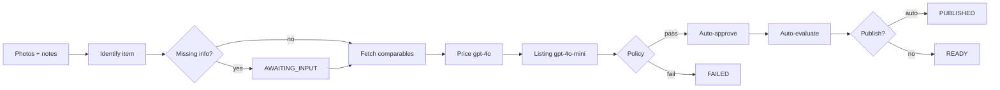

# Spot — Autonomous eBay Listing Agent

End-to-end autonomous agent: upload photos → identify item → market research → pricing → listing copy → policy-gated approve → evaluation → optional publish. Built for **CS153 (Automation / Agent Systems)**.

## Autonomous pipeline



| Step | Automated | Notes |
|------|-----------|-------|
| Photo identification | Yes | Vision model when `OPENAI_API_KEY` is set |
| Clarifying questions | Pauses agent | Status `AWAITING_INPUT` until answered via UI |
| eBay comparables (Browse + Insights) | Yes | Mock fallback when `EBAY_ALLOW_MOCK_FALLBACK=true` |
| Vision pricing | Yes | `OPENAI_PRICING_MODEL` (default `gpt-4o`); stats fallback if no key |
| Title, description, specifics | Yes | `OPENAI_MODEL` (default `gpt-4o-mini`) |
| Human review / approve | **No** | Policy gates only (`AGENT_AUTO_APPROVE`, confidence, warnings) |
| Publish | Optional | Manual button on item page; auto only if `AGENT_AUTO_PUBLISH=true` |

Optional human actions: **answer clarifying questions**, **re-run agent**, **delete**, **copy listing**, **connect eBay sandbox**, **publish to eBay**.

## Quick start

```bash
cp .env.example .env
# Set DATABASE_URL, DATABASE_URL_UNPOOLED, and optional AUTH_SECRET (see Authentication)
npm install
npm run db:deploy
npm run dev
```

Optional seed data: `npm run db:seed`

| Page | URL |
|------|-----|
| Landing (public) | [http://localhost:3000](http://localhost:3000) |
| Dashboard | [http://localhost:3000/dashboard](http://localhost:3000/dashboard) |
| Single item | [http://localhost:3000/items/new](http://localhost:3000/items/new) — 1–5 photos |
| Batch (closet mode) | [http://localhost:3000/items/batch](http://localhost:3000/items/batch) — up to 30 photos → AI clustering → up to 10 listings, processed sequentially in the background |
| Agent metrics | `/items/[id]/evaluate` |

`/dashboard`, `/items/*`, `/api/items/*`, and `/api/ebay/*` require sign-in (see Authentication). The landing page is public.

`POST /api/items` creates an item and runs the full agent **synchronously** in one request. Batch uploads queue background processing via `after()` and poll progress at `GET /api/items/batch/[id]`.

## Authentication

Spot uses a simple private-beta login form for the dashboard and item workflows. For now, the only authorized account is `shedenandemicael@gmail.com` with password `password`.

Sessions are stored in a signed HTTP-only cookie. The app has a built-in private-beta signing fallback, but production deployments can optionally set `AUTH_SECRET` to rotate the session-signing secret:

```bash
AUTH_SECRET=your-random-session-signing-secret
```

## Agent configuration (`.env`)

```bash
AGENT_AUTO_APPROVE=true          # default on; set "false" to disable
AGENT_CONFIDENCE_THRESHOLD=0.72
AGENT_AUTO_PUBLISH=false         # must be "true" for auto-publish
AGENT_PUBLISH_CONFIDENCE_THRESHOLD=0.85
AGENT_BLOCKING_WARNINGS=authenticity,recall,counterfeit
AGENT_TIME_SAVED_MINUTES=18      # recorded per run in EvaluationMetric
```

- Below confidence threshold → item `FAILED`, draft `REJECTED`.
- Warnings matching blocking patterns → `FAILED` (safety).
- `AGENT_AUTO_PUBLISH=true` + sandbox creds + connected seller OAuth → publish when confidence ≥ publish threshold.
- Otherwise items end at `READY`; use **Publish to eBay** on the item page.

### Sandbox publish (Sell API)

1. Set `EBAY_ENV=sandbox` and sandbox keys in `EBAY_SANDBOX_CLIENT_ID` / `EBAY_SANDBOX_CLIENT_SECRET` (keep production keys in `EBAY_PRODUCTION_*` or `EBAY_CLIENT_ID` for comps).
2. In [eBay Developer Portal](https://developer.ebay.com/my/keys) → User Tokens, add a **RuName** whose auth accept URL is `https://YOUR-DOMAIN/api/ebay/callback`. Set `EBAY_REDIRECT_URI` to that **RuName** string (not the full URL).
3. On an item page, click **Connect eBay Sandbox** and sign in with a [sandbox test user](https://developer.ebay.com/tools/sandbox-user).
4. Click **Set up sandbox policies** (or publish — policies are auto-created via Account API).
5. Click **Publish to eBay** on an item with status `READY` and an approved draft.

Authenticated curl examples (while logged in, or with session cookie):

```bash
curl -X POST http://localhost:3000/api/ebay/sell/setup-policies
curl http://localhost:3000/api/ebay/sell/status
```

## LLM & eBay

See `.env.example` for `OPENAI_*`, `EBAY_*`, and `PRICING_PROVIDER`.

| Variable | Default | Role |
|----------|---------|------|
| `LLM_PROVIDER` | `openai` in `.env.example`; `mock` if unset | Listing copy provider |
| `OPENAI_MODEL` | `gpt-4o-mini` | Listing generation |
| `OPENAI_PRICING_MODEL` | `gpt-4o` | Price determination |
| `PRICING_PROVIDER` | `openai` | Set `stats` to skip OpenAI for pricing |

Without `OPENAI_API_KEY`, listing and pricing fall back to mock/stats paths so the app still runs.

eBay research (read-only): `lib/ebay/fetch/`.

**Comps setup:** set `EBAY_PRODUCTION_CLIENT_ID` / `EBAY_PRODUCTION_CLIENT_SECRET` (or legacy `EBAY_CLIENT_ID` / `EBAY_CLIENT_SECRET`). Active listings use **Browse API** on `EBAY_RESEARCH_ENV` (defaults to `production`). Sold comps use **Marketplace Insights** when your key has access.

```bash
curl "http://localhost:3000/api/ebay/status?health=true"
curl "http://localhost:3000/api/ebay/comparables?q=nike+air+max+90&limit=8"
```

Response `meta` includes `activeCount`, `soldCount`, `researchEnv`, `searchAttempts`, and whether mock fallback was used. These routes require authentication.

### Production keyset compliance (subscribe, not opt out)

Production keys stay disabled until you **subscribe** to [Marketplace Account Deletion](https://developer.ebay.com/marketplace-account-deletion) notifications.

1. Deploy the app to an **HTTPS** URL (eBay rejects `localhost`).
2. Set in `.env`:
   ```bash
   EBAY_NOTIFICATION_VERIFICATION_TOKEN=your-random-32-to-80-char-token
   EBAY_NOTIFICATION_ENDPOINT_URL=https://YOUR-DOMAIN/api/ebay/notifications/account-deletion
   ```
3. In [Application Keys](https://developer.ebay.com/my/keys) → your app → **Alerts and Notifications**:
   - Select **Marketplace Account Deletion**
   - Notification endpoint URL + verification token (must match `.env`)
   - Click **Save** (eBay sends a GET challenge; the app responds automatically)
4. Click **Send Test Notification** — should return 200 OK
5. Production keyset becomes **compliant/active**

The webhook purges `EbayAccountRecord` rows when eBay sends a deletion event. This route is public (no auth).

## Deploy to Vercel (Neon Postgres)

1. Connect Neon in Vercel Storage with prefix **`DATABASE`** (creates `DATABASE_URL` + `DATABASE_URL_UNPOOLED`).
2. Add secrets in Vercel → Settings → Environment Variables (Production + Preview):
   - `AUTH_SECRET` (recommended in production)
   - `OPENAI_API_KEY`, `EBAY_*`, `NEXT_PUBLIC_APP_URL`, `EBAY_NOTIFICATION_*`, agent settings (see `.env.example`)
3. Push to GitHub — Vercel runs `vercel-build` → `prisma migrate deploy` then `next build`.
4. Set `NEXT_PUBLIC_APP_URL` and `EBAY_NOTIFICATION_ENDPOINT_URL` to your `https://….vercel.app` URL, then redeploy.

**Local dev with Neon:** copy `DATABASE_URL` and `DATABASE_URL_UNPOOLED` into `.env`, then `npm run db:deploy`.

**Photo uploads on Vercel:** add a [Vercel Blob](https://vercel.com/docs/storage/vercel-blob) store. That sets `BLOB_READ_WRITE_TOKEN` (and/or OIDC). Without it, uploads only work locally (`public/uploads`).

## API routes

| Route | Description |
|-------|-------------|
| `POST /api/items` | Create item + run full agent (sync) |
| `GET /api/items` | List items for dashboard |
| `POST /api/items/[id]/run` | Re-run autonomous agent |
| `POST /api/items/[id]/answer` | Answer clarifying questions and resume |
| `POST /api/items/[id]/publish` | Manual publish to eBay sandbox |
| `PATCH /api/items/[id]/draft` | Optional manual draft overrides |
| `PATCH /api/items/[id]/evaluation` | Save overall quality score (1–5) + notes |
| `DELETE /api/items/[id]` | Delete item and uploads |
| `POST /api/items/batch` | Batch upload + background processing |
| `POST /api/items/batch/cluster` | AI photo clustering for batch review |
| `GET /api/items/batch/[id]` | Poll batch progress |
| `GET /api/ebay/status` | eBay config (+ `?health=true`) |
| `GET /api/ebay/comparables?q=` | Test market fetch |
| `GET /api/ebay/sell/status` | Seller OAuth + policy status |
| `POST /api/ebay/sell/setup-policies` | Create sandbox sell policies |
| `GET /api/ebay/notifications/account-deletion` | eBay webhook challenge (public) |

Legacy `POST /api/items/[id]/generate` still runs the older `generateListingForItem` path (pre-agent); the main flow uses `runAutonomousAgent` via `POST /api/items` or `/run`.

## Project structure

```
app/                Next.js pages and API routes
components/         UI (intake forms, agent timeline, eBay panel)
lib/agent/          Autonomous pipeline (`runAutonomousAgent`)
lib/ai/             LLM providers + vision encoding
lib/pricing/        Price determination (OpenAI vision or stats)
lib/ebay/fetch/     eBay read APIs (Browse, Insights, Taxonomy)
lib/ebay/sell/      eBay Sell API (inventory, offers, publish)
lib/services/       Item intake, batch, upload
middleware.ts       Session gate for protected routes
prisma/             Schema + migrations (Postgres)
```

## CS153 project summary

| | |
|---|---|
| **Title** | Autonomous eBay Resale Agent (Spot) |
| **Track** | Automation / Agent Systems |
| **Repo** | [github.com/shedenandemicael/cs153-proj](https://github.com/shedenandemicael/cs153-proj) |

**Problem.** Listing resale items on eBay is repetitive: research comps, set a price, write title/description/specifics, then publish.

**What the agent does.** Upload photos (+ optional notes) → identify item → fetch eBay comparables → vision-based pricing → generate listing copy → policy-gated auto-approve → record metrics → optional sandbox publish. Human steps are limited to answering clarifying questions, re-running, or manually publishing.

**Evaluation.** Each autonomous run writes `EvaluationMetric` at `/items/[id]/evaluate`: estimated time saved (default 18 min), 8 generated fields (`TRACKED_GENERATED_FIELDS`), human edits before approval (0 in the default autonomous flow), and an automated quality score from model confidence. `PATCH /api/items/[id]/evaluation` accepts an overall score (1–5) and notes; `components/evaluation/EvaluationPanel.tsx` defines a 4-dimension rubric UI but is not mounted on the evaluate page today.

**Safety.** Publish is off by default (`AGENT_AUTO_PUBLISH=false`). Low-confidence drafts and compliance warnings (authenticity, recall, counterfeit) fail the pipeline instead of auto-approving.

**AI usage.** Much of the code was written using AI tools (Codex, Cursor), but I did the product design — problem framing, agent workflow, policy gates, and integration architecture.

**Stack.** Next.js, TypeScript, Prisma/Neon Postgres, OpenAI (vision + text), eBay Browse/Insights/Sell APIs.
