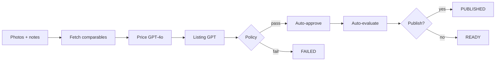

# Resale Agent — Autonomous eBay Listing Agent

End-to-end autonomous agent: upload photos → market research → pricing → listing copy → auto-approve → evaluation → optional publish. Built for **CS153 (Automation / Agent Systems)**.

## Autonomous pipeline



| Step | Automated |
|------|-----------|
| eBay comparables (Browse + Insights) | Yes |
| Vision pricing | Yes |
| Title, description, specifics | Yes |
| Human review / approve | **No** (policy only) |
| Publish | Optional (`AGENT_AUTO_PUBLISH=true`) |

Human actions are optional: **re-run agent**, **delete**, **copy listing**.

## Quick start

```bash
cp .env.example .env
npm install
npx prisma migrate dev
npm run dev
```

- **Single item:** [http://localhost:3000/items/new](http://localhost:3000/items/new)
- **Batch (closet mode):** [http://localhost:3000/items/batch](http://localhost:3000/items/batch) — up to 10 items, processed sequentially in the background

## Agent configuration (`.env`)

```bash
AGENT_AUTO_APPROVE=true
AGENT_CONFIDENCE_THRESHOLD=0.72
AGENT_AUTO_PUBLISH=false
AGENT_PUBLISH_CONFIDENCE_THRESHOLD=0.85
AGENT_BLOCKING_WARNINGS=authenticity,recall,counterfeit
```

- Below confidence threshold → item `FAILED`, draft rejected.
- Warnings matching blocking patterns → `FAILED` (safety).
- `AGENT_AUTO_PUBLISH=true` + eBay sandbox creds → publish when confidence ≥ publish threshold.

## LLM & eBay

See `.env.example` for `OPENAI_*`, `EBAY_*`, and `PRICING_PROVIDER`.

eBay fetch-only research: `lib/ebay/fetch/`.

**Comps setup:** add `EBAY_CLIENT_ID` and `EBAY_CLIENT_SECRET` from [eBay Developer](https://developer.ebay.com/). Active listings use the **Browse API** on `EBAY_RESEARCH_ENV` (defaults to `production` because sandbox has almost no inventory). Sold comps use **Marketplace Insights** if your key has access (often 403 until approved).

```bash
# Verify config + live API connectivity
curl "http://localhost:3000/api/ebay/status?health=true"

# Test comparables search
curl "http://localhost:3000/api/ebay/comparables?q=nike+air+max+90&limit=8"
```

Response `meta` includes `activeCount`, `soldCount`, `researchEnv`, `searchAttempts`, and whether mock fallback was used.

### Production keyset compliance (subscribe, not opt out)

Production keys stay disabled until you **subscribe** to [Marketplace Account Deletion](https://developer.ebay.com/marketplace-account-deletion) notifications.

1. Deploy the app to an **HTTPS** URL (eBay rejects `localhost`). Use Vercel, ngrok, etc.
2. Set in `.env`:
   ```bash
   EBAY_NOTIFICATION_VERIFICATION_TOKEN=your-random-32-to-80-char-token
   EBAY_NOTIFICATION_ENDPOINT_URL=https://YOUR-DOMAIN/api/ebay/notifications/account-deletion
   ```
3. In [Application Keys](https://developer.ebay.com/my/keys) → your app → **Alerts and Notifications**:
   - Select **Marketplace Account Deletion**
   - Alert email: your email
   - Notification endpoint URL: same as `EBAY_NOTIFICATION_ENDPOINT_URL`
   - Verification token: same as `EBAY_NOTIFICATION_VERIFICATION_TOKEN`
   - Click **Save** (eBay sends a GET challenge; the app responds automatically)
4. Click **Send Test Notification** — should return 200 OK
5. Production keyset becomes **compliant/active**

The webhook purges `EbayAccountRecord` rows (OAuth tokens / user IDs) when eBay sends a deletion event.

## API routes

| Route | Description |
|-------|-------------|
| `POST /api/items` | Create item + run full agent |
| `POST /api/items/batch` | Batch upload + background processing |
| `GET /api/items/batch/[id]` | Poll batch progress |
| `POST /api/items/[id]/run` | Re-run agent |
| `GET /api/ebay/status` | eBay config |
| `GET /api/ebay/comparables?q=` | Test market fetch |

Legacy `PATCH /api/items/[id]/draft` remains for optional manual overrides.

## Project structure

```
lib/agent/          Autonomous pipeline orchestrator
lib/ebay/fetch/     eBay read APIs (Browse, Insights, Taxonomy)
lib/ai/             Listing copy generation
lib/pricing/        Price determination (GPT-4o)
app/items/[id]/     Agent result + run timeline
```

## CS153 fit

Demonstrates a **fully agentic workflow** with explicit policy gates instead of human-in-the-loop UI. Evaluation metrics are recorded automatically (`fieldsEditedByUser` stays 0 unless overrides are added later).
