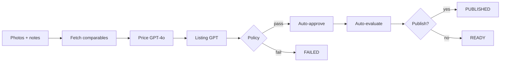

# Resale Agent — Autonomous eBay Listing Agent

End-to-end autonomous agent: upload photos → market research → pricing → listing copy → auto-approve → evaluation → optional publish. Built for **CS153 (Automation / Agent Systems)**.

## Autonomous pipeline



| Step | Automated |
|------|-----------|
| eBay comparables (Browse + Insights) | Yes |
| Vision pricing | Yes |
| Title, description, specifics | Yes |
| Human review / approve | **No** (policy only) |
| Publish | Optional (`AGENT_AUTO_PUBLISH=true`) |

Human actions are optional: **re-run agent**, **delete**, **copy listing**, **connect eBay sandbox**, **publish to eBay**.

## Quick start

```bash
cp .env.example .env
# Add Neon DATABASE_URL + DATABASE_URL_UNPOOLED and auth secrets (see below)
npm install
npm run db:deploy
npm run dev
```

- **Landing page:** [http://localhost:3000](http://localhost:3000)
- **Dashboard:** [http://localhost:3000/dashboard](http://localhost:3000/dashboard)
- **Single item:** [http://localhost:3000/items/new](http://localhost:3000/items/new)
- **Batch (closet mode):** [http://localhost:3000/items/batch](http://localhost:3000/items/batch) — up to 10 items, processed sequentially in the background

## Authentication

Spot uses Google OAuth for the product dashboard and item workflows. For now, the only authorized Google account is `shedenandemicael@gmail.com`.

Set these environment variables before using the protected app routes:

```bash
AUTH_SECRET=your-random-session-signing-secret
GOOGLE_CLIENT_ID=your-google-oauth-client-id
GOOGLE_CLIENT_SECRET=your-google-oauth-client-secret
```

In Google Cloud Console, add this authorized redirect URI for local development:

```text
http://localhost:3000/api/auth/google/callback
```

Add the matching production callback URL after deployment.

## Agent configuration (`.env`)

```bash
AGENT_AUTO_APPROVE=true
AGENT_CONFIDENCE_THRESHOLD=0.72
AGENT_AUTO_PUBLISH=false
AGENT_PUBLISH_CONFIDENCE_THRESHOLD=0.85
AGENT_BLOCKING_WARNINGS=authenticity,recall,counterfeit
```

- Below confidence threshold → item `FAILED`, draft rejected.
- Warnings matching blocking patterns → `FAILED` (safety).
- `AGENT_AUTO_PUBLISH=true` + sandbox creds + **connected seller OAuth** → publish when confidence ≥ publish threshold.

### Sandbox publish (Sell API)

1. Set `EBAY_ENV=sandbox` and sandbox keys in `EBAY_SANDBOX_CLIENT_ID` / `EBAY_SANDBOX_CLIENT_SECRET` (keep production keys in `EBAY_PRODUCTION_*` or `EBAY_CLIENT_ID` for comps).
2. In [eBay Developer Portal](https://developer.ebay.com/my/keys) → User Tokens, add a **RuName** whose auth accept URL is `https://YOUR-DOMAIN/api/ebay/callback`. Set `EBAY_REDIRECT_URI` to that **RuName** string (not the full URL).
3. On an item page, click **Connect eBay Sandbox** and sign in with a [sandbox test user](https://developer.ebay.com/tools/sandbox-user).
4. On an item page, click **Set up sandbox policies** (or publish — policies are auto-created via Account API). No Seller Hub needed.
5. Click **Publish to eBay** on an item with status `READY` and an approved draft.

```bash
curl -X POST http://localhost:3000/api/ebay/sell/setup-policies
```

```bash
curl http://localhost:3000/api/ebay/sell/status
```

## LLM & eBay

See `.env.example` for `OPENAI_*`, `EBAY_*`, and `PRICING_PROVIDER`.

eBay fetch-only research: `lib/ebay/fetch/`.

**Comps setup:** add `EBAY_CLIENT_ID` and `EBAY_CLIENT_SECRET` from [eBay Developer](https://developer.ebay.com/). Active listings use the **Browse API** on `EBAY_RESEARCH_ENV` (defaults to `production` because sandbox has almost no inventory). Sold comps use **Marketplace Insights** if your key has access (often 403 until approved).

```bash
# Verify config + live API connectivity
curl "http://localhost:3000/api/ebay/status?health=true"

# Test comparables search
curl "http://localhost:3000/api/ebay/comparables?q=nike+air+max+90&limit=8"
```

Response `meta` includes `activeCount`, `soldCount`, `researchEnv`, `searchAttempts`, and whether mock fallback was used.

### Production keyset compliance (subscribe, not opt out)

Production keys stay disabled until you **subscribe** to [Marketplace Account Deletion](https://developer.ebay.com/marketplace-account-deletion) notifications.

1. Deploy the app to an **HTTPS** URL (eBay rejects `localhost`). Use Vercel, ngrok, etc.
2. Set in `.env`:
   ```bash
   EBAY_NOTIFICATION_VERIFICATION_TOKEN=your-random-32-to-80-char-token
   EBAY_NOTIFICATION_ENDPOINT_URL=https://YOUR-DOMAIN/api/ebay/notifications/account-deletion
   ```
3. In [Application Keys](https://developer.ebay.com/my/keys) → your app → **Alerts and Notifications**:
   - Select **Marketplace Account Deletion**
   - Alert email: your email
   - Notification endpoint URL: same as `EBAY_NOTIFICATION_ENDPOINT_URL`
   - Verification token: same as `EBAY_NOTIFICATION_VERIFICATION_TOKEN`
   - Click **Save** (eBay sends a GET challenge; the app responds automatically)
4. Click **Send Test Notification** — should return 200 OK
5. Production keyset becomes **compliant/active**

The webhook purges `EbayAccountRecord` rows (OAuth tokens / user IDs) when eBay sends a deletion event.

## Deploy to Vercel (Neon Postgres)

1. Connect Neon in Vercel Storage with prefix **`DATABASE`** (creates `DATABASE_URL` + `DATABASE_URL_UNPOOLED`).
2. Add remaining secrets in Vercel → Settings → Environment Variables (Production + Preview):
   - `OPENAI_API_KEY`, `EBAY_*`, `NEXT_PUBLIC_APP_URL`, `EBAY_NOTIFICATION_*`, agent settings (see `.env.example`)
3. Push to GitHub — Vercel runs `vercel-build` → `prisma migrate deploy` then `next build`.
4. Set `NEXT_PUBLIC_APP_URL` and `EBAY_NOTIFICATION_ENDPOINT_URL` to your `https://….vercel.app` URL, then redeploy.

**Local dev with Neon:** copy `DATABASE_URL` and `DATABASE_URL_UNPOOLED` from Vercel (or Neon dashboard) into `.env`, then `npm run db:deploy`.

**Photo uploads on Vercel:** add a [Vercel Blob](https://vercel.com/docs/storage/vercel-blob) store (Storage → Create → Blob → connect to this project). That sets `BLOB_STORE_ID` (OIDC) and/or `BLOB_READ_WRITE_TOKEN`. Without a linked store, uploads only work locally (`public/uploads`).

## API routes

| Route | Description |
|-------|-------------|
| `POST /api/items` | Create item + run full agent |
| `POST /api/items/batch` | Batch upload + background processing |
| `GET /api/items/batch/[id]` | Poll batch progress |
| `POST /api/items/[id]/run` | Re-run agent |
| `GET /api/ebay/status` | eBay config |
| `GET /api/ebay/comparables?q=` | Test market fetch |

Legacy `PATCH /api/items/[id]/draft` remains for optional manual overrides.

## Project structure

```
lib/agent/          Autonomous pipeline orchestrator
lib/ebay/fetch/     eBay read APIs (Browse, Insights, Taxonomy)
lib/ai/             Listing copy generation
lib/pricing/        Price determination (GPT-4o)
app/items/[id]/     Agent result + run timeline
```

## CS153 project summary

| | |
|---|---|
| **Title** | Autonomous eBay Resale Agent (Spot) |
| **Track** | Automation / Agent Systems |
| **Repo** | [github.com/shedenandemicael/cs153-proj](https://github.com/shedenandemicael/cs153-proj) |

**Problem.** Listing resale items on eBay is repetitive: research comps, set a price, write title/description/specifics, then publish.

**What the agent does.** Upload photos (+ optional notes) → identify item → fetch eBay comparables → vision-based pricing → generate listing copy → policy-gated auto-approve → record metrics → optional sandbox publish. Human steps are limited to answering clarifying questions, re-running, or manually publishing.

**Evaluation.** Each autonomous run records metrics at `/items/[id]/evaluate`: estimated time saved, fields generated, human edits before approval, and an automated quality score (derived from model confidence). The app also supports a manual listing-quality rubric (title clarity, description completeness, pricing reasonableness, category accuracy) via `PATCH /api/items/[id]/evaluation`.

**Safety.** Publish is off by default (`AGENT_AUTO_PUBLISH=false`). Low-confidence drafts and compliance warnings (authenticity, recall, counterfeit) fail the pipeline instead of auto-approving.

**AI usage.** Much of the code was written using AI tools (Codex, Cursor), but I did the product design — problem framing, agent workflow, policy gates, and integration architecture.

**Stack.** Next.js, TypeScript, Prisma/Neon Postgres, OpenAI (vision + text), eBay Browse/Insights/Sell APIs.
